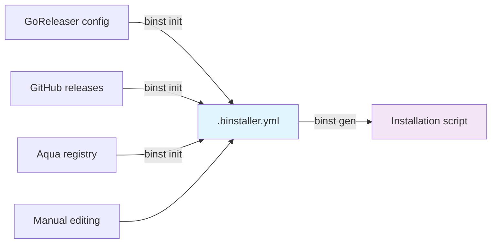

# binstaller

<p align="center">
  <h3 align="center">binstaller</h3>
  <p align="center">A modern, secure binary installer generator with enhanced security features</p>
  <p align="center">
    <a href="/LICENSE.md"></a>
    <a href="https://github.com/haya14busa/binstaller/releases"></a>
  </p>
</p>

---

**binstaller** (binst) is a modern binary installer generator that creates secure, reproducible installation scripts for static binaries distributed via GitHub releases. Works with Go binaries, Rust binaries, and any other static binaries - as long as they're released on GitHub, binstaller can generate installation scripts for them.

## 🔄 How it Works

binstaller follows a simple two-step workflow:



**Step 1:** `binst init` - Generate a `.binstaller.yml` config from various sources  
**Step 2 (Optional):** `binst embed-checksums` - Embed checksums into the config for enhanced security  
**Step 3:** `binst gen` - Generate the final installation script

## ✨ Key Features

* 🛡️ **Enhanced Security**: Optional checksum embedding for enhanced verification
* 🔧 **Multiple Sources**: Support for GoReleaser, GitHub releases, and Aqua registry
* 📦 **Flexible Configuration**: YAML-based `.binstaller.yml` configuration files
* 🎯 **Cross-Platform**: Works across Linux, macOS, Windows, and other Unix-like systems
* ⚡ **Fast Installation**: Dramatically faster than `go install` (up to 100x improvement)
* 🔁 **Reproducible Builds**: Generate consistent installation scripts with source traceability
* 🌐 **Universal Support**: Works with any static binary on GitHub releases (Go, Rust, C++, etc.)

## 🚀 Quick Start

### Installation

```bash
# Install the latest version
go install github.com/haya14busa/binstaller/cmd/binst@latest

# Or download from GitHub releases
curl -sfL https://raw.githubusercontent.com/haya14busa/binstaller/main/install.sh | sh
```

### Basic Usage

The workflow in action:

```bash
# Step 1: Initialize configuration from a source
binst init --source=github --repo=owner/repo -o .binstaller.yml

# Step 2 (Optional): Embed checksums for enhanced security
binst embed-checksums --config .binstaller.yml

# Step 3: Generate installation script
binst gen -o install.sh

# Or without embedded checksums
binst init --source=goreleaser --file=.goreleaser.yml | binst gen > install.sh
```

## 📖 Usage Examples

### From GoReleaser Configuration

```bash
# Step 1: Extract config from GoReleaser YAML
binst init --source=goreleaser --file=.goreleaser.yml -o .binstaller.yml

# Step 2 (Optional): Embed checksums for enhanced security
binst embed-checksums --config .binstaller.yml

# Step 3: Generate installer script
binst gen --config=.binstaller.yml -o install.sh
```

### From GitHub Repository

```bash
# Step 1: Auto-detect from GitHub releases API
binst init --source=github --repo=junegunn/fzf -o fzf.binstaller.yml

# Step 2 (Optional): Embed checksums for enhanced security
binst embed-checksums --config fzf.binstaller.yml

# Step 3: Generate installer
binst gen --config=fzf.binstaller.yml -o fzf-install.sh
```

### From Aqua Registry

```bash
# Step 1: Convert from Aqua package definition
binst init --source=aqua --repo=aquaproj/aqua-registry --file=pkgs/g/golangci-lint.yaml -o golangci-lint.binstaller.yml

# Step 2 (Optional): Embed checksums for enhanced security
binst embed-checksums --config golangci-lint.binstaller.yml

# Step 3: Generate installer
binst gen --config=golangci-lint.binstaller.yml -o golangci-lint-install.sh
```

### Manual Configuration

```bash
# Step 1: Create or edit .binstaller.yml manually
vim .binstaller.yml

# Step 2 (Optional): Embed checksums for enhanced security
binst embed-checksums --config .binstaller.yml

# Step 3: Generate installer script
binst gen -o install.sh
```

## ⚙️ Configuration Format

The `.binstaller.yml` configuration file uses a simple, declarative format:

```yaml
schema: v1
name: fzf
repo: junegunn/fzf
default_version: latest
asset:
  template: ${NAME}-${VERSION}-${OS}_${ARCH}${EXT}
  default_extension: .tar.gz
  rules:
    - when:
        os: windows
      ext: .zip
checksums:
  template: ${NAME}_${VERSION}_checksums.txt
  algorithm: sha256
supported_platforms:
  - os: linux
    arch: amd64
  - os: darwin
    arch: amd64
  - os: windows
    arch: amd64
```

## 🔧 Advanced Features

### Security Features

* **Embedded Checksums**: Use `binst embed-checksums` to embed checksums directly into the configuration for enhanced security
* **Automatic Verification**: When checksums are embedded, downloaded binaries are automatically verified
* **Reproducible Scripts**: Generated scripts are deterministic and traceable
* **Flexible Security**: Choose between external checksum files or embedded checksums based on your needs

### CI/CD Integration

Perfect for CI/CD pipelines where you need fast, reliable binary installations:

```yaml
# GitHub Actions example
- name: Install tool
  run: |
    curl -sfL https://raw.githubusercontent.com/your-org/your-tool/main/install.sh | sh
    echo "./bin" >> $GITHUB_PATH
```

## 🎯 Why binstaller?

binstaller provides a modern, secure approach to binary installation:

* **Universal Support**: Unlike tools focused only on Go, works with any static binary on GitHub
* **Enhanced Security**: Embedded checksums provide better security than traditional approaches
* **Flexible Configuration**: YAML-based configuration is more maintainable than command-line flags

## 📄 License

This project is licensed under the MIT License - see the [LICENSE.md](LICENSE.md) file for details.

## 🙏 Acknowledgments

* Original [GoDownloader](https://github.com/goreleaser/godownloader) project by the GoReleaser team
* [Aqua](https://aquaproj.github.io/) project for package management inspiration
* All contributors who have helped improve this project
