# Comparison: Original GoDownloader vs. Fork

This document provides a detailed comparison between the original [GoDownloader](https://github.com/goreleaser/godownloader) project and this fork, highlighting the differences, improvements, and rationale behind the changes.

## Overview

```mermaid
flowchart LR
    subgraph Original["Original GoDownloader"]
        A1[GoReleaser YAML Parsing]
        A2[Shell Script Generation]
        A3[Checksum Verification]
        A4[Equinox.io Support]
        A5[Raw GitHub Releases]
        A6[Tree Walking]
    end
    
    subgraph Fork["GoDownloader Fork"]
        B1[GoReleaser YAML Parsing]
        B2[Shell Script Generation]
        B3[Checksum Verification]
        B7[GitHub Attestation Verification]
        B8[Improved Error Handling]
        B9[Enhanced Documentation]
    end
    
    Original --> Fork
    
    style Original fill:#f9f9f9,stroke:#333,stroke-width:1px
    style Fork fill:#e6f7ff,stroke:#333,stroke-width:1px
```



The original GoDownloader project was created as a companion tool to GoReleaser, generating shell scripts for downloading and installing Go binaries. While it served its purpose well, it was archived in January 2022 due to maintenance constraints and a suggestion to potentially merge this functionality into GoReleaser itself.

This fork aims to revive the project with a more focused approach, removing unnecessary features, enhancing security, and improving maintainability.

## Feature Comparison

| Feature | Original GoDownloader | This Fork | Notes |
|---------|----------------------|-----------|-------|
| GoReleaser YAML Parsing | ✅ | ✅ | Core functionality retained |
| Shell Script Generation | ✅ | ✅ | Enhanced with better error handling |
| Checksum Verification | ✅ | ✅ | Core security feature retained |
| Equinox.io Support | ✅ | ❌ | Removed to simplify codebase |
| Raw GitHub Releases | ✅ | ❌ | Removed to focus on GoReleaser integration |
| Tree Walking | ✅ | ❌ | Removed to simplify codebase |
| GitHub Attestation Verification | ❌ | ✅ | Added to enhance security |
| Comprehensive Documentation | ❌ | ✅ | Added to improve usability |
| Modern Dependency Management | ❌ | ✅ | Updated to use latest Go modules |
| Improved Error Handling | ❌ | ✅ | Enhanced for better user experience |
| Configurable Security Options | ❌ | ✅ | Added for flexibility |

## Code Structure Comparison

### Original GoDownloader

The original project had a relatively flat structure with most functionality in the root package:

```
godownloader/
├── main.go
├── source.go
├── shell_equinoxio.go
├── shell_godownloader.go
├── shell_raw.go
├── shellfn.go
└── treewalk.go
```

### This Fork

This fork reorganizes the code into a more modular structure:

```
godownloader/
├── cmd/
│   └── godownloader/
│       └── main.go
├── internal/
│   ├── config/
│   │   └── config.go
│   ├── shell/
│   │   ├── generator.go
│   │   └── template.go
│   └── attestation/
│       └── verify.go
├── pkg/
│   ├── download/
│   │   └── download.go
│   └── verify/
│       └── verify.go
└── docs/
    ├── design/
    │   ├── overview.md
    │   └── attestation.md
    ├── README.md
    ├── usage.md
    ├── security.md
    └── roadmap.md
```

## Detailed Changes

### 1. Removed Features

#### Equinox.io Support

**Original Implementation:**
```go
// processEquinoxio create a fake goreleaser config for equinox.io
// and use a similar template.
func processEquinoxio(repo string) ([]byte, error) {
    if repo == "" {
        return nil, fmt.Errorf("must have repo")
    }
    project := config.Project{}
    project.Release.GitHub.Owner = path.Dir(repo)
    project.Release.GitHub.Name = path.Base(repo)
    project.Builds = []config.Build{
        {Binary: path.Base(repo)},
    }
    project.Archive.Format = "tgz"
    return makeShell(shellEquinoxio, &project)
}
```

**Rationale for Removal:**
- Equinox.io is not widely used compared to GitHub Releases
- Maintaining this code adds complexity without significant benefit
- The fork focuses on GitHub Releases as the primary distribution method

#### Raw GitHub Releases

**Original Implementation:**
```go
// processRaw handles raw binaries uploaded to GitHub releases
func processRaw(repo string, exe string, nametpl string) ([]byte, error) {
    if repo == "" {
        return nil, fmt.Errorf("must have GitHub owner/repo")
    }
    if exe == "" {
        exe = path.Base(repo)
    }
    if nametpl == "" {
        nametpl = "{{ .Binary }}_v{{ .Version }}_{{ .Os }}_{{ .Arch }}"
    }
    
    // translate golang template to shell string
    name, err := makeName("NAME=", nametpl)
    if err != nil {
        return nil, err
    }
    
    project := config.Project{}
    project.Release.GitHub.Owner = path.Dir(repo)
    project.Release.GitHub.Name = path.Base(repo)
    project.Builds = []config.Build{
        {Binary: exe},
    }
    project.Archive.NameTemplate = name
    return makeShell(shellRaw, &project)
}
```

**Rationale for Removal:**
- GoDownloader is primarily designed to work with GoReleaser
- Supporting raw binaries adds complexity to the codebase
- Encourages users to adopt GoReleaser for a more standardized approach

#### Tree Walking

**Original Implementation:**
```go
// treewalk walks the directory looking for .yaml files and generates
// downloader scripts from them.
func treewalk(root string, treeout string, forceWrite bool) error {
    rooterr := filepath.Walk(root, func(path string, info os.FileInfo, err error) error {
        // ... implementation details ...
    })
    return rooterr
}
```

**Rationale for Removal:**
- This feature was primarily used for the godownloader.sh website
- It adds significant complexity to the codebase
- The fork focuses on the core functionality of generating individual scripts

### 2. Added Features

#### GitHub Attestation Verification

**New Implementation:**
```go
// verifyAttestation verifies the GitHub attestation for a binary
func verifyAttestation(binary, attestation string) error {
    // Implementation details for attestation verification
    // ...
}
```

**Rationale for Addition:**
- Enhances security by verifying the authenticity of binaries
- Protects against supply chain attacks
- Aligns with modern security best practices

#### Improved Error Handling

**Original Approach:**
```go
if err != nil {
    log.WithError(err).Error("failed")
    os.Exit(1)
}
```

**New Approach:**
```go
if err != nil {
    return fmt.Errorf("failed to process configuration: %w", err)
}
```

**Rationale for Change:**
- Provides more context in error messages
- Uses error wrapping for better error handling
- Improves user experience by providing clearer error messages

### 3. Enhanced Documentation

**Original Documentation:**
Limited to a README.md file with basic usage instructions.

**New Documentation:**
Comprehensive documentation covering:
- Design overview
- Attestation verification details
- Usage guide
- Security considerations
- Implementation roadmap
- Comparison with original project

**Rationale for Enhancement:**
- Improves user experience
- Makes the project more accessible to new users
- Provides clear guidance for contributors
- Documents design decisions for future reference

## Performance Comparison

| Metric | Original GoDownloader | This Fork | Improvement |
|--------|----------------------|-----------|-------------|
| Script Generation Time | Baseline | Similar | - |
| Memory Usage | Baseline | Reduced | Less overhead from removed features |
| Installation Time | Baseline | Similar | - |
| Security | Basic | Enhanced | Added attestation verification |

## Compatibility

This fork maintains compatibility with GoReleaser configuration files, ensuring a smooth transition for existing users. The generated shell scripts are also compatible with the same environments supported by the original project.

However, users relying on the removed features (Equinox.io support, raw GitHub releases, tree walking) will need to adapt their workflows.

## Migration Guide

For users of the original GoDownloader, migrating to this fork is straightforward:

1. **Standard GoReleaser Users**: No changes needed, simply use the new tool
2. **Equinox.io Users**: Switch to GoReleaser for releasing binaries
3. **Raw GitHub Release Users**: Adopt GoReleaser for a more standardized approach
4. **Tree Walking Users**: Generate scripts individually for each repository

## Conclusion

This fork of GoDownloader represents a focused, security-enhanced evolution of the original project. By removing unnecessary features and adding GitHub attestation verification, it provides a more maintainable and secure tool for generating installation scripts for Go binaries.

The changes align with modern Go development practices and security standards, ensuring the project remains valuable and relevant for years to come.