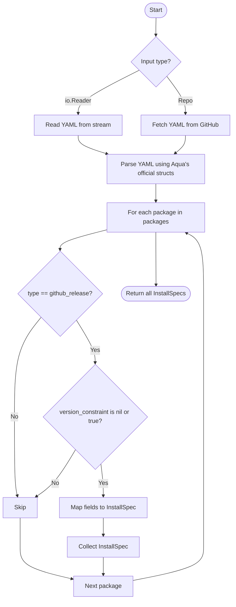

# Design: Aqua Registry Adapter for InstallSpec Conversion

## Overview

This document describes the design for a new `SourceAdapter` that converts an [aqua registry](https://github.com/aquaproj/aqua-registry) YAML file (conforming to the official schema) into one or more `InstallSpec` objects. The primary focus is on supporting packages of `type: github_release`.

## Goals

- Support conversion of aqua registry YAML files (with full schema) to InstallSpec(s).
- Initially support only packages of `type: github_release`.
- Provide a clear mapping between aqua registry fields and InstallSpec fields.
- Enable integration with the `binst init` command as a new source type.
- Ensure extensibility for future aqua registry types and fields.
- **Leverage the official Aqua Go structs for registry metadata and package definitions to ensure compatibility.**
- **Support multiple input sources: io.Reader (stdin, file, etc.) or direct fetch from GitHub.**

## Input Options

The adapter should support the following input modes:

1. **io.Reader (Stream)**  
   The adapter accepts an `io.Reader` for cases where the YAML is provided as a stream (e.g., from stdin, a file, HTTP response, etc.).

2. **Direct Fetch from GitHub**  
   The adapter can fetch the registry YAML directly from a GitHub repository, specifically from  
   `https://github.com/aquaproj/aqua-registry/pkgs/<owner>/<repo_name>/registry.yaml`  
   This enables use cases where the user specifies only the owner/repo, and the adapter retrieves the YAML automatically.

## Registry Metadata and File Resolution

The Aqua project defines a `Registry` struct in [github.com/aquaproj/aqua/pkg/config/aqua/registry.go](https://github.com/aquaproj/aqua/blob/main/pkg/config/aqua/registry.go) that describes how to locate and validate registry files. This struct includes fields such as:

- `Name`, `Type` (standard, local, github_content), `RepoOwner`, `RepoName`, `Ref`, `Path`, `Private`

The adapter will use this struct and its methods (e.g., `FilePath`, `Validate`, `UnmarshalYAML`) to:
- Locate the correct registry YAML file on disk or in a remote repository
- Handle different registry types (standard, local, github_content)
- Ensure robust and maintainable file resolution

## Aqua Registry Schema (Summary)

- The registry file is an object with a `packages` field, which is an array of `PackageInfo` objects (as defined in the Aqua codebase).
- Each `PackageInfo` describes a package, with fields such as:
  - `name`, `type`, `repo_owner`, `repo_name`, `asset`, `files`, `supported_envs`, `description`, `checksum`, `overrides`, `version_constraint`, etc.
- See the [official schema](https://github.com/aquaproj/aqua/blob/main/pkg/config/registry/config_schema.json) and Go structs for full details.

### Example (Simplified)

```yaml
packages:
  - name: gh
    type: github_release
    repo_owner: cli
    repo_name: cli
    asset: "gh_{{.Version}}_{{.OS}}_{{.Arch}}.tar.gz"
    description: "GitHub’s official command line tool"
    files:
      - name: gh
        src: gh
    supported_envs:
      - linux/amd64
      - darwin/amd64
      - windows/amd64
    checksum:
      type: github_release
      asset: "checksums.txt"
      algorithm: sha256
    version_constraint: true
```

## Mapping to InstallSpec

| Aqua Registry Field         | InstallSpec Field         | Notes                                 |
|----------------------------|--------------------------|---------------------------------------|
| type                       | (must be github_release) | Only this type is supported initially |
| name                       | Name                     |                                       |
| files.name                 | Name (if not set), AssetRule.Binaries | Use the first file's name for InstallSpec name if not set; all files.name to AssetRule.Binaries |
| repo_owner/repo_name       | Repo                     | Concatenate as "owner/name"           |
| asset                      | Asset.Template           | Template conversion may be needed     |
| description                | Description              | Optional                              |
| supported_envs             | SupportedPlatforms       | Map to InstallSpec platform format    |
| checksum.asset             | Checksums.Template       |                                       |
| checksum.algorithm         | Checksums.Algorithm      |                                       |
| overrides, format_overrides| Asset.Rules, etc.        | Map as appropriate                    |
| version_constraint         | (filter)                 | Only include packages with no version_constraint or version_constraint: true |
| version_filter, version_prefix | (not mapped)         | Out of scope for initial version      |

- If `name` is missing, use the first file's name if available.
- All `files.name` values are mapped to `AssetRule.Binaries` in InstallSpec.
- Only packages with no `version_constraint` or with `version_constraint: true` are converted; others are skipped.
- If `supported_envs` is missing, default to common platforms or error.
- Only packages with `type: github_release` are converted; others are skipped or error.

## Adapter Interface

```go
type AquaRegistryAdapter struct {
    // One of the following will be set depending on input mode:
    reader io.Reader     // Stream input (stdin, file, HTTP, etc.)
    repo   string        // GitHub repo in "owner/name" format (for direct fetch)
}

func NewAquaRegistryAdapterFromReader(reader io.Reader) SourceAdapter
func NewAquaRegistryAdapterFromRepo(repo string) SourceAdapter

// Returns a slice of InstallSpec, one for each supported package.
func (a *AquaRegistryAdapter) GenerateInstallSpecs(ctx context.Context) ([]*spec.InstallSpec, error)
```

## Conversion Flow



## Edge Cases & Validation

- Only `type: github_release` is supported; skip or error for other types.
- Only packages with no `version_constraint` or with `version_constraint: true` are included.
- If `name` and `files` are both missing, error or require user to specify name override.
- If `supported_envs` is missing, default to common platforms or error.
- Template variables in `asset` may need conversion to InstallSpec format.
- Handle overrides and format_overrides if present.
- Use Aqua's validation methods where possible.

## Extensibility

- The adapter can be extended to support other aqua registry types in the future.
- Field mapping logic should be modular to allow for new fields or types.
- Consider supporting additional InstallSpec features as aqua registry evolves.

## Example Usage

```go
// From io.Reader (stdin, file, etc.)
adapter := NewAquaRegistryAdapterFromReader(reader)
installSpecs, err := adapter.GenerateInstallSpecs(ctx)

// From GitHub repo
adapter := NewAquaRegistryAdapterFromRepo("cli/cli")
installSpecs, err := adapter.GenerateInstallSpecs(ctx)
```

## Summary

This adapter will enable seamless conversion from aqua registry YAML (github_release) to InstallSpec(s), facilitating migration and integration with binstaller workflows. The design is schema-driven, leverages official Aqua Go structs, supports multiple input sources, and is extensible for future needs.