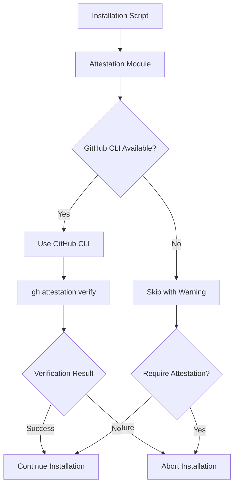

# GitHub Attestation Verification Implementation

This document provides a detailed technical overview of the GitHub attestation verification implementation in the GoDownloader fork.

## Introduction to GitHub Attestations

GitHub Attestations are cryptographically signed statements about artifacts in a GitHub release. They provide a way to verify the authenticity and integrity of released artifacts, enhancing security for users who install binaries via the generated shell scripts.

## Technical Architecture



The attestation verification system is designed with a simple approach:

1. **Primary Method**: Use GitHub CLI (`gh`) if available
2. **GitHub CLI Required**: Skip verification with a warning if GitHub CLI is not available
3. **Configuration Options**: Allow users to customize verification behavior

## GitHub CLI Integration

The attestation verification leverages the GitHub CLI's `attestation verify` command, which provides comprehensive verification capabilities.

### GitHub CLI Command Details

The `gh attestation verify` command (as of GitHub CLI version 2.69.0) provides the following functionality:

```
gh attestation verify [<file-path> | oci://<image-uri>] [--owner | --repo] [flags]
```

This command verifies the integrity and provenance of an artifact using its associated cryptographically signed attestations. The verification process:

1. Validates the identity of the Actions workflow that produced the attestation (the signer workflow)
2. Checks the signatures in the attestations
3. Confirms that the attestation refers to the provided artifact

#### Required Parameters

To specify the artifact, the command requires:
- A file path to an artifact, or
- A container image URI (e.g., `oci://<image-uri>`)

To fetch the attestation and validate the identity of the signer, the command requires either:
- The `--repo` flag (e.g., `--repo github/example`), or
- The `--owner` flag (e.g., `--owner github`)

#### Key Flags

| Flag | Description |
|------|-------------|
| `--repo string` | Repository name in the format `<owner>/<repo>` |
| `--owner string` | GitHub organization to scope attestation lookup by |
| `--predicate-type string` | Filter attestations by provided predicate type (default "https://slsa.dev/provenance/v1") |
| `--deny-self-hosted-runners` | Fail verification for attestations generated on self-hosted runners |
| `--cert-identity string` | Enforce that the certificate's subject alternative name matches the provided value exactly |
| `--cert-identity-regex string` | Enforce that the certificate's subject alternative name matches the provided regex |
| `--signer-repo string` | Repository of reusable workflow that signed attestation in the format <owner>/<repo> |
| `--signer-workflow string` | Workflow that signed attestation in the format [host/]<owner>/<repo>/<path>/<to>/<workflow> |

### Integration in Shell Scripts

The GitHub CLI integration in the shell script will look like this:

```bash
verify_attestation() {
  local binary=$1
  local repo=$2
  local extra_flags=$3
  
  if is_command gh; then
    log_info "Using GitHub CLI for attestation verification"
    
    # Basic verification with repository information
    if [ -n "$repo" ]; then
      if gh attestation verify --repo="${repo}" "${binary}" ${extra_flags}; then
        log_info "Attestation verification successful"
        return 0
      else
        log_err "Attestation verification failed"
        return 1
      fi
    # Fallback to owner-only verification if repo not specified
    elif [ -n "$OWNER" ]; then
      if gh attestation verify --owner="${OWNER}" "${binary}" ${extra_flags}; then
        log_info "Attestation verification successful"
        return 0
      else
        log_err "Attestation verification failed"
        return 1
      fi
    else
      log_err "Repository or owner information required for attestation verification"
      return 1
    fi
  else
    log_warn "GitHub CLI not available, skipping attestation verification"
    log_warn "For enhanced security, install GitHub CLI: https://cli.github.com/"
    
    # If attestation is required, fail the installation
    if [ "${REQUIRE_ATTESTATION}" = "true" ]; then
      log_err "Attestation verification required but GitHub CLI is not available"
      return 1
    fi
    
    # Otherwise, continue with a warning
    return 0
  fi
}
```

### Passing Verification Flags

The implementation allows passing additional flags to the `gh attestation verify` command in two ways:

1. **At script generation time**: Using the `--gh-attestation-verify-flags` option with the `godownloader` command:

```bash
godownloader --repo=owner/repo --require-attestation \
  --gh-attestation-verify-flags="--deny-self-hosted-runners --cert-identity=https://github.com/owner/repo/.github/workflows/release.yml@refs/heads/main" \
  > install.sh
```

2. **At runtime**: Using the `GH_ATTESTATION_VERIFY_FLAGS` environment variable when running the installation script:

```bash
curl -sfL https://example.com/install.sh | GH_ATTESTATION_VERIFY_FLAGS="--deny-self-hosted-runners" sh
```

This approach provides flexibility for both script generators and end users.

### Advanced Usage Examples

The implementation supports various verification scenarios:

```bash
# Basic verification with repository information
verify_attestation "${binary}" "owner/repo" ""

# Verification with additional flags for enhanced security
verify_attestation "${binary}" "owner/repo" "--deny-self-hosted-runners --predicate-type=https://slsa.dev/provenance/v1"

# Verification with custom certificate identity
verify_attestation "${binary}" "owner/repo" "--cert-identity=https://github.com/owner/repo/.github/workflows/release.yml@refs/heads/main"
```

## Integration with Installation Flow

The attestation verification is integrated into the main execution flow of the generated shell scripts:

```bash
execute() {
  tmpdir=$(mktemp -d)
  log_debug "downloading files into ${tmpdir}"
  
  # Download binary
  http_download "${tmpdir}/${TARBALL}" "${TARBALL_URL}"
  
  # Download checksum
  http_download "${tmpdir}/${CHECKSUM}" "${CHECKSUM_URL}"
  
  # Verify checksum
  hash_sha256_verify "${tmpdir}/${TARBALL}" "${tmpdir}/${CHECKSUM}"
  
  # Download attestation if available
  if [ "${VERIFY_ATTESTATION}" = "true" ]; then
    if http_download "${tmpdir}/${TARBALL}.attestation" "${TARBALL_URL}.attestation"; then
      # Verify attestation
      extra_flags="${GH_ATTESTATION_VERIFY_FLAGS:-${DEFAULT_GH_ATTESTATION_VERIFY_FLAGS}}"
      if ! verify_attestation "${tmpdir}/${TARBALL}" "${OWNER}/${REPO}" "${extra_flags}"; then
        log_crit "Attestation verification failed"
        exit 1
      fi
      log_info "Attestation verification successful"
    elif [ "${REQUIRE_ATTESTATION}" = "true" ]; then
      log_crit "Attestation required but not available"
      exit 1
    else
      log_info "No attestation available, skipping verification"
    fi
  fi
  
  # Continue with installation
  # ...
}
```

## Configuration Options

The attestation verification system provides several configuration options:

### Command-line Options for GoDownloader

When generating the installation script:

```bash
# Require attestation verification
godownloader --repo=owner/repo --require-attestation > install.sh

# Skip attestation verification
godownloader --repo=owner/repo --skip-attestation > install.sh

# Specify custom attestation verification flags
godownloader --repo=owner/repo --gh-attestation-verify-flags="--deny-self-hosted-runners" > install.sh
```

### Runtime Options for Installation Scripts

When running the installation script:

```bash
# Skip attestation verification
curl -sfL https://example.com/install.sh | VERIFY_ATTESTATION=false sh

# Require attestation verification
curl -sfL https://example.com/install.sh | REQUIRE_ATTESTATION=true sh

# Specify custom attestation verification flags
curl -sfL https://example.com/install.sh | GH_ATTESTATION_VERIFY_FLAGS="--deny-self-hosted-runners" sh
```

## Advanced Verification Features

The implementation supports advanced verification features provided by the GitHub CLI:

### Reusable Workflow Verification

For attestations generated by reusable workflows:

```bash
godownloader --repo=owner/repo --require-attestation \
  --gh-attestation-verify-flags="--signer-repo=actions/reusable-workflow" > install.sh
```

### Custom Predicate Types

For verifying specific types of attestations:

```bash
godownloader --repo=owner/repo --require-attestation \
  --gh-attestation-verify-flags="--predicate-type=https://slsa.dev/provenance/v1" > install.sh
```

### Self-hosted Runner Restrictions

For enhanced security, the implementation can be configured to reject attestations from self-hosted runners:

```bash
godownloader --repo=owner/repo --require-attestation \
  --gh-attestation-verify-flags="--deny-self-hosted-runners" > install.sh
```

## Implementation Challenges and Solutions

### Challenge 1: GitHub CLI Availability

**Challenge**: The GitHub CLI may not be installed on all systems.

**Solution**: 
1. Provide clear instructions for installing the GitHub CLI
2. Make attestation verification optional by default but configurable
3. Allow strict enforcement with the `--require-attestation` flag

### Challenge 2: Attestation Format Changes

**Challenge**: The attestation format may change over time.

**Solution**: 
1. Rely on the GitHub CLI which will be updated to support new formats
2. Document the version of GitHub CLI required for attestation verification

### Challenge 3: Offline Verification

**Challenge**: Some environments may not have internet access.

**Solution**:
1. Document offline verification procedures
2. Provide options for downloading attestations separately

## Testing Strategy

The attestation verification implementation is tested using:

1. **Unit Tests**: Test individual functions in isolation
2. **Integration Tests**: Test the entire verification flow
3. **Compatibility Tests**: Test with different versions of GitHub CLI
4. **Edge Cases**: Test with malformed attestations, missing files, etc.

Example test cases:

```go
func TestAttestationVerification(t *testing.T) {
    tests := []struct {
        name               string
        binary             string
        repo               string
        flags              string
        ghInstalled        bool
        requireAttestation bool
        expectedResult     bool
    }{
        {
            name:               "Valid attestation with GitHub CLI",
            binary:             "testdata/valid-binary",
            repo:               "owner/repo",
            flags:              "",
            ghInstalled:        true,
            requireAttestation: false,
            expectedResult:     true,
        },
        {
            name:               "Invalid signature with GitHub CLI",
            binary:             "testdata/valid-binary",
            repo:               "owner/repo",
            flags:              "",
            ghInstalled:        true,
            requireAttestation: false,
            expectedResult:     false,
        },
        {
            name:               "No GitHub CLI installed",
            binary:             "testdata/valid-binary",
            repo:               "owner/repo",
            flags:              "",
            ghInstalled:        false,
            requireAttestation: false,
            expectedResult:     true,  // Continues with warning
        },
        {
            name:               "No GitHub CLI installed with require-attestation",
            binary:             "testdata/valid-binary",
            repo:               "owner/repo",
            flags:              "",
            ghInstalled:        false,
            requireAttestation: true,
            expectedResult:     false,  // Fails when attestation is required
        },
    }
    
    for _, tt := range tests {
        t.Run(tt.name, func(t *testing.T) {
            // Mock GitHub CLI availability
            mockGhInstalled(tt.ghInstalled)
            
            // Set require attestation flag
            os.Setenv("REQUIRE_ATTESTATION", fmt.Sprintf("%t", tt.requireAttestation))
            
            result := VerifyAttestation(tt.binary, tt.repo, tt.flags)
            if result != tt.expectedResult {
                t.Errorf("VerifyAttestation() = %v, want %v", result, tt.expectedResult)
            }
        })
    }
}
```

## Performance Considerations

The attestation verification adds some overhead to the installation process:

1. **Additional Download**: The attestation file must be downloaded
2. **Verification Time**: The verification process takes time, especially with the GitHub CLI
3. **Memory Usage**: Parsing and verifying attestations requires memory

To mitigate these issues:

1. **Parallel Downloads**: Download binary, checksum, and attestation in parallel
2. **Skip Option**: Allow users to skip verification if needed

## Security Considerations

While attestation verification enhances security, there are some considerations:

1. **Trust Chain**: The verification is only as secure as the trust in GitHub and the release process
2. **Initial Script Execution**: The initial curl | bash is still executed without verification
3. **Network Dependency**: Verification requires access to GitHub's servers
4. **GitHub CLI Dependency**: Verification requires the GitHub CLI to be installed

## Future Enhancements

1. **Multiple Attestation Types**: Support different types of attestations (build, security scan, etc.)
2. **Custom Verification Policies**: Allow projects to specify custom verification requirements
3. **Offline Verification**: Enhance support for verifying attestations without network access
4. **Alternative Verification Tools**: Support for using tools like `cosign` for verification when GitHub CLI is not available

## Conclusion

The GitHub attestation verification implementation provides a robust security enhancement to the GoDownloader fork. By leveraging the GitHub CLI's comprehensive verification capabilities, it ensures that users can verify the authenticity and integrity of downloaded binaries, enhancing the security of the installation process.