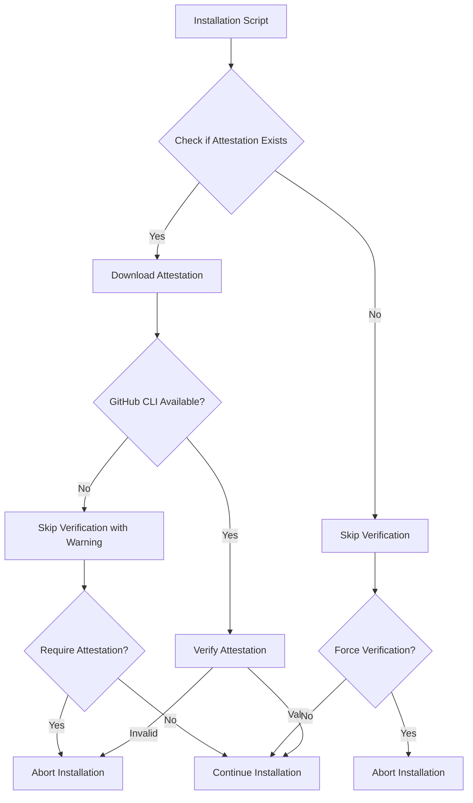
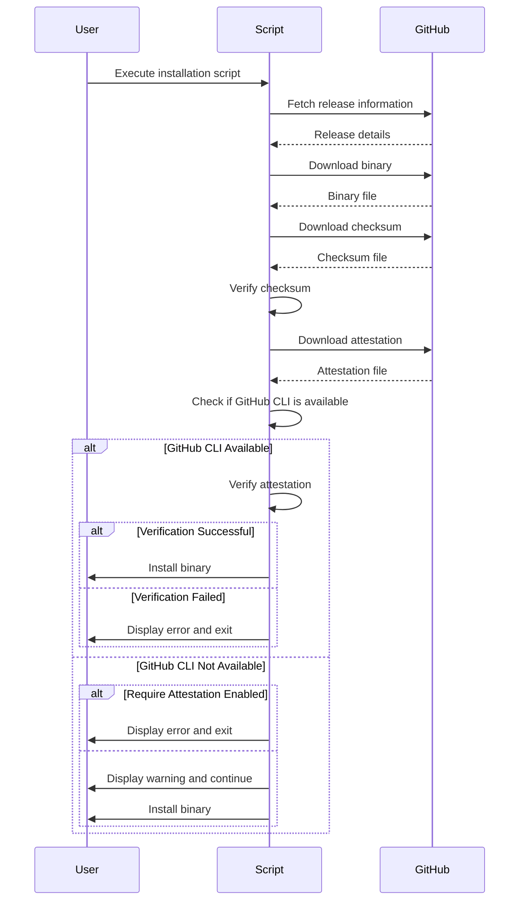

# GitHub Attestation Verification Design

## Overview

GitHub Attestations provide a way to verify the authenticity and integrity of released artifacts. This document outlines the design for integrating GitHub attestation verification into the GoDownloader fork, enhancing security for users who install binaries via the generated shell scripts.

## Background

### What are GitHub Attestations?

GitHub Attestations are cryptographically signed statements about artifacts in a GitHub release. They can attest to various properties of the artifacts, such as:

- The artifact was built from a specific commit
- The artifact was built in a secure environment
- The artifact passed certain security scans
- The artifact was signed by a trusted entity

These attestations are stored alongside the release artifacts and can be verified to ensure the integrity and authenticity of the downloaded binaries.

### Why Add Attestation Verification?

Adding attestation verification to GoDownloader provides several benefits:

1. **Enhanced Security**: Users can verify that the binaries they download were built from the expected source code and haven't been tampered with.
2. **Supply Chain Security**: Helps protect against supply chain attacks by verifying the provenance of binaries.
3. **Trust**: Increases trust in the installation process, especially for security-sensitive applications.

## Technical Design



### Components

1. **Attestation Fetcher**: Responsible for downloading attestation data from GitHub releases.
2. **GitHub CLI Integration**: Uses the GitHub CLI to verify attestations.
3. **Shell Script Integration**: Updates the shell script template to include attestation verification.

### Implementation Details

#### 1. Attestation Fetching

The installation script will check for and download attestation files from the GitHub release:

```bash
# Example shell script snippet
fetch_attestation() {
  local version=$1
  local binary=$2
  local url="${GITHUB_DOWNLOAD}/${version}/${binary}.attestation"
  
  if http_download "${TMPDIR}/${binary}.attestation" "$url"; then
    log_info "Downloaded attestation for ${binary}"
    return 0
  else
    log_info "No attestation found for ${binary}"
    return 1
  fi
}
```

#### 2. Attestation Verification

The script will use the `gh` CLI tool to verify the attestation:

```bash
# Example shell script snippet
verify_attestation() {
  local binary=$1
  local repo=$2
  local extra_flags=$3
  
  if is_command gh; then
    log_info "Using GitHub CLI for attestation verification"
    if gh attestation verify --repo="${repo}" "${binary}" ${extra_flags}; then
      log_info "Attestation verification successful"
      return 0
    else
      log_err "Attestation verification failed"
      return 1
    fi
  else
    log_warn "GitHub CLI not available, skipping attestation verification"
    log_warn "For enhanced security, install GitHub CLI: https://cli.github.com/"
    
    # If attestation is required, fail the installation
    if [ "${REQUIRE_ATTESTATION}" = "true" ]; then
      log_err "Attestation verification required but GitHub CLI is not available"
      return 1
    fi
    
    # Otherwise, continue with a warning
    return 0
  fi
}
```

#### 3. Configuration Options

Users will be able to configure attestation verification behavior:

- `--require-attestation`: Fail if attestation is missing or invalid (including if GitHub CLI is not available)
- `--skip-attestation`: Skip attestation verification entirely
- `--gh-attestation-verify-flags`: Specify additional flags to pass to the `gh attestation verify` command

### Passing Verification Flags

The implementation allows passing additional flags to the `gh attestation verify` command in two ways:

1. **At script generation time**: Using the `--gh-attestation-verify-flags` option with the `godownloader` command:

```bash
godownloader --repo=owner/repo --require-attestation \
  --gh-attestation-verify-flags="--deny-self-hosted-runners --cert-identity=https://github.com/owner/repo/.github/workflows/release.yml@refs/heads/main" \
  > install.sh
```

2. **At runtime**: Using the `GH_ATTESTATION_VERIFY_FLAGS` environment variable when running the installation script:

```bash
curl -sfL https://example.com/install.sh | GH_ATTESTATION_VERIFY_FLAGS="--deny-self-hosted-runners" sh
```

This approach provides flexibility for both script generators and end users.

### Shell Script Integration

The attestation verification will be integrated into the main execution flow of the generated shell scripts:



## GitHub CLI Attestation Verify Command

The GoDownloader fork will leverage the `gh attestation verify` command from the GitHub CLI. This command provides comprehensive verification of attestations, including validation of the identity of the Actions workflow that produced the attestation.

### Command Syntax

```
gh attestation verify [<file-path> | oci://<image-uri>] [--owner | --repo] [flags]
```

### Key Flags

- `--repo string`: Repository name in the format `<owner>/<repo>`
- `--owner string`: GitHub organization to scope attestation lookup by
- `--predicate-type string`: Filter attestations by provided predicate type (default "https://slsa.dev/provenance/v1")
- `--format string`: Output format (e.g., json)
- `--cert-identity string`: Enforce that the certificate's subject alternative name matches the provided value exactly
- `--cert-identity-regex string`: Enforce that the certificate's subject alternative name matches the provided regex
- `--deny-self-hosted-runners`: Fail verification for attestations generated on self-hosted runners

### Verification Process

The verification process using the GitHub CLI involves:

1. **Signature Verification**: Validating the cryptographic signatures in the attestations
2. **Identity Validation**: Confirming the identity of the Actions workflow that produced the attestation
3. **Artifact Matching**: Verifying that the attestation refers to the provided artifact
4. **Policy Enforcement**: Applying additional policy checks as specified by the flags

### Examples

```bash
# Verify an artifact linked with a repository
gh attestation verify example.bin --repo github/example

# Verify an artifact linked with an organization
gh attestation verify example.bin --owner github

# Verify an artifact and output the full verification result
gh attestation verify example.bin --owner github --format json

# Verify an artifact with enhanced security checks
gh attestation verify example.bin --repo github/example --deny-self-hosted-runners

# Verify an artifact signed with a reusable workflow
gh attestation verify example.bin --owner github --signer-repo actions/example
```

## GitHub CLI Dependency

The attestation verification feature requires the GitHub CLI (`gh`) to be installed on the user's system. If the GitHub CLI is not available:

1. The script will display a warning message
2. Attestation verification will be skipped
3. The installation will continue unless `--require-attestation` is specified

This approach ensures that:
- Users without the GitHub CLI can still install binaries
- Users are informed about the security benefits of installing the GitHub CLI
- Projects that require strict security can enforce attestation verification

## Future Enhancements

1. **Multiple Attestation Types**: Support different types of attestations (build, security scan, etc.)
2. **Custom Verification Logic**: Allow projects to specify custom verification requirements
3. **Offline Verification**: Support for verifying attestations without network access
4. **Alternative Verification Tools**: Support for using tools like `cosign` for verification when GitHub CLI is not available

## Conclusion

Adding GitHub attestation verification to GoDownloader will significantly enhance the security of the installation process. By verifying the authenticity and integrity of downloaded binaries, users can have greater confidence in the software they install through the generated shell scripts.