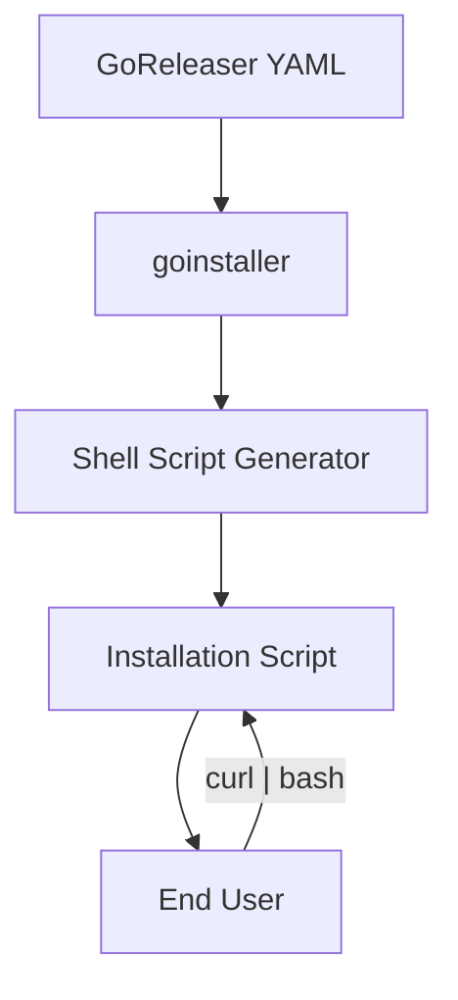
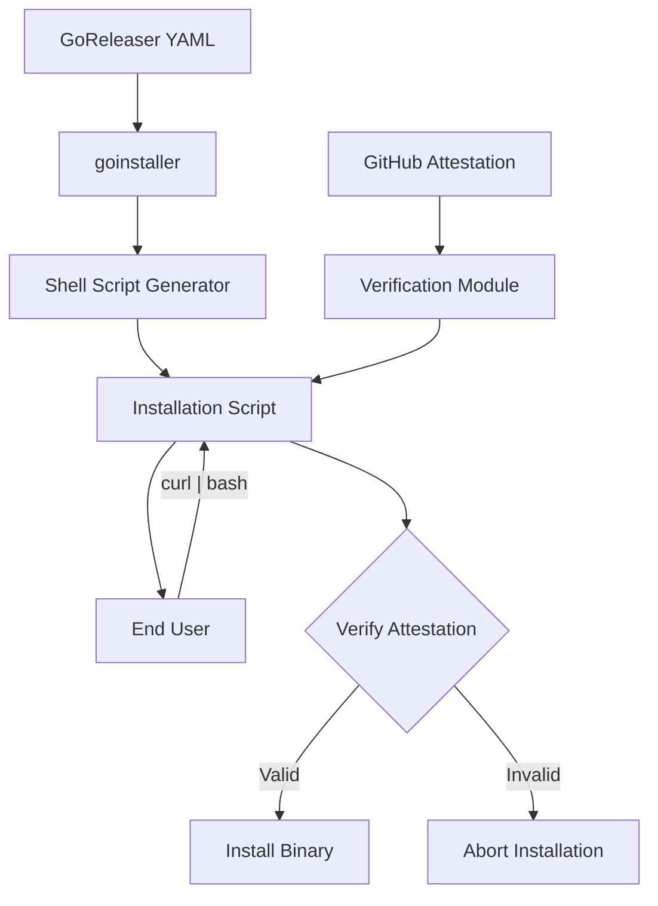
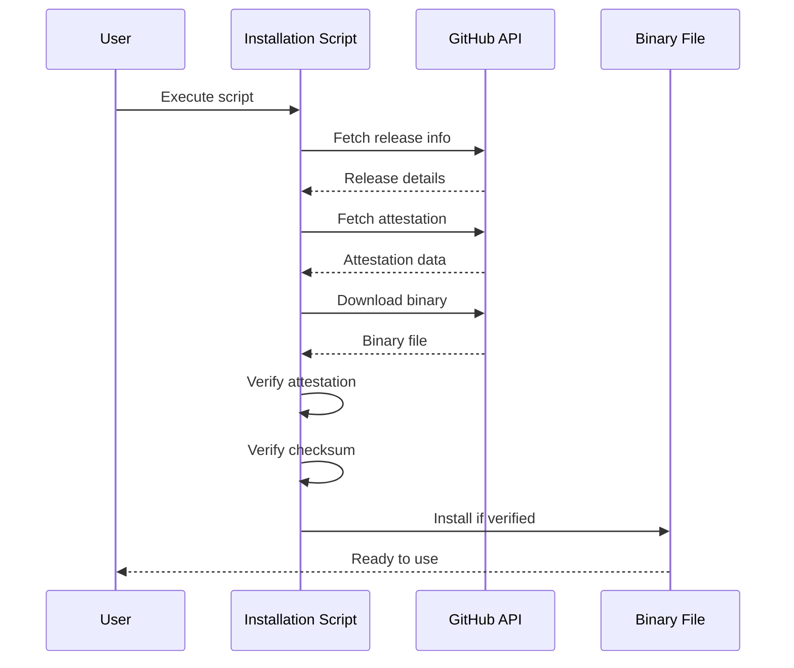

# goinstaller Design Overview

## Background

[GoDownloader](https://github.com/goreleaser/godownloader) was originally created as a companion tool to [GoReleaser](https://github.com/goreleaser/goreleaser). It generates shell scripts that can download the right package and version of Go binaries released with GoReleaser. This makes it easy for users to install Go applications with a simple curl | bash command.

The original project has been archived since January 2022 (see [issue #161](https://github.com/goreleaser/godownloader/issues/161)) due to maintenance constraints and a suggestion to potentially merge this functionality into GoReleaser itself. However, the core functionality of generating installation scripts remains valuable for many projects.

## Vision for goinstaller

goinstaller aims to:

1. Streamline the codebase by removing unnecessary features
2. Enhance security with GitHub attestation verification
3. Focus on maintainability and stability
4. Provide a simpler, more focused tool that does one thing well

## Core Features to Retain



1. **GoReleaser YAML Parsing**: Continue to read and parse GoReleaser configuration files to understand the structure of releases.
2. **Shell Script Generation**: Generate shell scripts that can download and install binaries from GitHub releases.
3. **Checksum Verification**: Maintain the ability to verify checksums of downloaded binaries.
4. **Cross-Platform Support**: Continue supporting various operating systems and architectures.

## Features to Remove

1. **Equinox.io Support**: Remove support for Equinox.io as it's not widely used and adds complexity.
2. **Raw GitHub Releases**: Remove support for "naked" releases on GitHub that don't use GoReleaser.
3. **Tree Walking**: Simplify by removing the tree walking functionality that generates multiple outputs.

## New Features to Add



1. **GitHub Attestation Verification**: Add support for verifying GitHub attestations to enhance security.
   - Implement `gh attestation verify` functionality
   - Allow users to configure attestation requirements
   - Provide clear error messages for attestation failures

2. **Simplified Configuration**: Create a more straightforward configuration approach that focuses on the essential parameters.

## Technical Design

### Code Structure

The project will have a clean, modular structure:

```
goinstaller/
├── cmd/
│   └── goinstaller/
│       └── main.go
├── internal/
│   ├── config/
│   │   └── config.go
│   ├── shell/
│   │   ├── generator.go
│   │   └── template.go
│   └── attestation/
│       └── verify.go
├── pkg/
│   ├── download/
│   │   └── download.go
│   └── verify/
│       └── verify.go
└── docs/
    ├── design/
    │   └── overview.md
    └── usage.md
```

### GitHub Attestation Verification

The GitHub attestation verification feature will:

1. Use the GitHub API to fetch attestations for a release
2. Verify the attestation using cryptographic signatures
3. Check that the attestation matches the binary being downloaded
4. Abort the installation if verification fails



### Shell Script Template

The shell script template will be simplified to focus on the core functionality:

1. Parse arguments (version, installation directory)
2. Determine the appropriate binary for the user's system
3. Download the binary and its checksum
4. Verify the checksum
5. Verify the attestation (new feature)
6. Install the binary

## Implementation Plan

1. **Phase 1**: Fork the repository and remove unnecessary features
   - Remove Equinox.io support
   - Remove raw GitHub releases support
   - Remove tree walking functionality
   - Clean up and simplify the codebase

2. **Phase 2**: Add GitHub attestation verification
   - Implement attestation fetching
   - Implement verification logic
   - Update shell script template to include verification

3. **Phase 3**: Testing and documentation
   - Create comprehensive tests for all functionality
   - Update documentation to reflect changes
   - Create examples for users

## Conclusion

goinstaller provides a focused, security-enhanced tool for generating installation scripts for Go binaries. By removing unnecessary features and adding GitHub attestation verification, it is easier to maintain and provides better security guarantees for users.