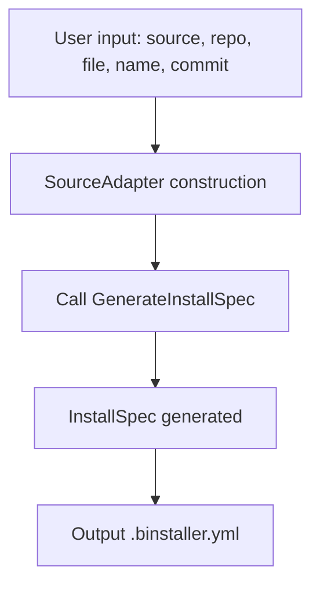

# Refactoring Plan for `binst init` SourceAdapter

## Current Issues

- The `SourceAdapter` interface currently has a `Detect(ctx, input DetectInput)` method, and `DetectInput` contains multipurpose fields (FilePath, Repo, Tag, AssetPattern, Flags, etc.).
- Context (e.g., commit, filePath) is passed both at adapter construction and again via `DetectInput`.
- The meaning and usage of `DetectInput` fields differ by adapter, making the interface responsibility ambiguous.
- The method name `Detect` suggests "detection" rather than "config generation," which is the actual responsibility.

## Target Design

- Clarify the responsibility of the adapter as "InstallSpec generation," and rename the method to something like `GenerateSpec` or `GenerateInstallSpec`.
- Pass all required information (e.g., repo, filePath, commit, nameOverride) at adapter construction. The method call should require minimal or no input struct.
- If different adapters require different information, make it explicit in the constructor arguments.
- Simplify the interface method signature to improve extensibility and testability.

---

## New Interface Proposal

```go
// Clarify the responsibility of the adapter
type SourceAdapter interface {
    // Generate an InstallSpec
    GenerateInstallSpec(ctx context.Context) (*spec.InstallSpec, error)
}
```

### Example of Adapter Construction

```go
// Pass all required information at construction
adapter := datasource.NewGoReleaserAdapter(
    repo,         // string
    filePath,     // string
    commit,       // string
    nameOverride, // string
)
```

### Example Implementation (goreleaserAdapter)

```go
type goreleaserAdapter struct {
    repo         string
    filePath     string
    commit       string
    nameOverride string
}

func NewGoReleaserAdapter(repo, filePath, commit, nameOverride string) SourceAdapter {
    return &goreleaserAdapter{
        repo:         repo,
        filePath:     filePath,
        commit:       commit,
        nameOverride: nameOverride,
    }
}

func (a *goreleaserAdapter) GenerateInstallSpec(ctx context.Context) (*spec.InstallSpec, error) {
    // Use a.repo, a.filePath, a.commit, a.nameOverride to generate InstallSpec
}
```

---

## `binst init` Flow (New Design)



- Pass all required information at adapter construction
- `GenerateInstallSpec` generates the InstallSpec with no additional arguments (other than context)
- Remove the input struct and generic Flags

---

## Summary

- Limit the responsibility of the adapter to "InstallSpec generation" and clarify the method name
- Pass all required information at adapter construction
- Remove the input struct and generic Flags to improve extensibility, readability, and testability