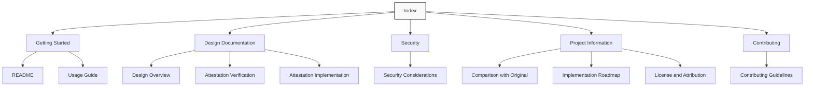

# goinstaller Documentation Index

Welcome to the documentation for goinstaller. This index provides an overview of all available documentation to help you navigate the project.

## Overview

goinstaller is a streamlined version of the original [GoDownloader](https://github.com/goreleaser/godownloader) project, with enhanced security features including GitHub attestation verification. It generates shell scripts for downloading and installing Go binaries from GitHub releases.

## Documentation Sections

### Getting Started

- [**README**](README.md) - Project overview and basic usage
- [**Usage Guide**](usage.md) - Comprehensive guide on using the tool

### Design Documentation

- [**Design Overview**](design/overview.md) - High-level design of the project
- [**Attestation Verification**](design/attestation.md) - Design of the GitHub attestation verification feature
- [**Attestation Implementation**](design/attestation-implementation.md) - Technical details of the attestation verification implementation

### Security

- [**Security Considerations**](security.md) - Security aspects of goinstaller

### Project Information

- [**Comparison with Original**](comparison.md) - Detailed comparison with the original GoDownloader
- [**Implementation Roadmap**](roadmap.md) - Development plan and timeline
- [**License and Attribution**](license-and-attribution.md) - License information and attribution to original authors

### Contributing

- [**Contributing Guidelines**](contributing.md) - How to contribute to the project

## Documentation Map



## Quick Reference

### Installation

```bash
# Install the latest version
go install github.com/haya14busa/goinstaller@latest
```

### Basic Usage

```bash
# Generate an installation script for a GitHub repository
goinstaller --repo=owner/repo > install.sh

# Generate an installation script with attestation verification
goinstaller --repo=owner/repo --require-attestation > install.sh
```

### Key Features

- GoReleaser YAML parsing
- Shell script generation
- Checksum verification
- GitHub attestation verification
- Cross-platform support

## Document Status

| Document | Status | Last Updated |
|----------|--------|--------------|
| README | Draft | 2025-04-17 |
| Usage Guide | Draft | 2025-04-17 |
| Design Overview | Draft | 2025-04-17 |
| Attestation Verification | Draft | 2025-04-17 |
| Attestation Implementation | Draft | 2025-04-17 |
| Security Considerations | Draft | 2025-04-17 |
| Comparison with Original | Draft | 2025-04-17 |
| Implementation Roadmap | Draft | 2025-04-17 |
| License and Attribution | Draft | 2025-04-17 |
| Contributing Guidelines | Draft | 2025-04-17 |

## Feedback and Contributions

We welcome feedback on the documentation and contributions to improve it. Please see the [Contributing Guidelines](contributing.md) for information on how to contribute.

## License

The documentation is licensed under the MIT License. See the [License and Attribution](license-and-attribution.md) document for details.