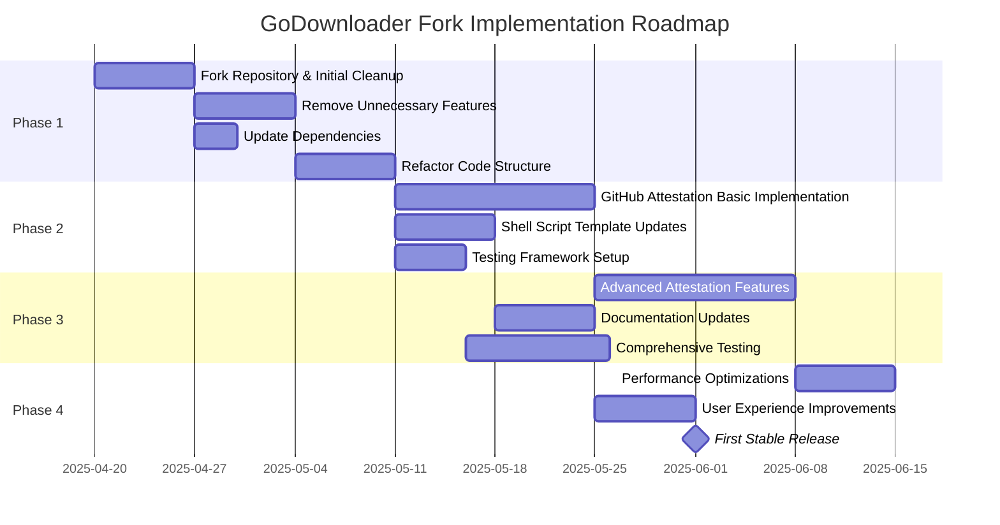

# GoDownloader Fork Implementation Roadmap

This document outlines the implementation plan for the GoDownloader fork, providing a roadmap for development and prioritization of features.

## Project Phases

The implementation of the GoDownloader fork is divided into several phases, each with specific goals and deliverables.

## Phase 1: Foundation (Weeks 1-3)

The first phase focuses on establishing a solid foundation for the project by cleaning up the codebase and removing unnecessary features.

### Goals

- Fork the repository and set up the development environment
- Remove unnecessary features (Equinox.io support, raw GitHub releases, tree walking)
- Update dependencies to their latest versions
- Refactor the code structure for better maintainability

### Tasks

1. **Fork Repository & Initial Setup**
   - Create the new repository
   - Set up CI/CD pipelines
   - Update README and documentation to reflect the fork

2. **Remove Unnecessary Features**
   - Remove Equinox.io support
   - Remove raw GitHub releases support
   - Remove tree walking functionality
   - Clean up related code and tests

3. **Update Dependencies**
   - Update Go dependencies to latest versions
   - Replace deprecated libraries
   - Fix any compatibility issues

4. **Refactor Code Structure**
   - Reorganize code into logical packages
   - Improve error handling
   - Enhance logging
   - Implement better configuration management

### Deliverables

- Clean, streamlined codebase
- Updated dependencies
- Improved code structure
- Basic documentation

## Phase 2: Core Features (Weeks 4-6)

The second phase focuses on implementing the core features of the fork, particularly the GitHub attestation verification.

### Goals

- Implement basic GitHub attestation verification
- Update shell script templates
- Set up a comprehensive testing framework

### Tasks

1. **GitHub Attestation Basic Implementation**
   - Implement attestation fetching
   - Implement basic verification logic
   - Add configuration options for attestation verification

2. **Shell Script Template Updates**
   - Update templates to include attestation verification
   - Improve error handling in scripts
   - Enhance user feedback during installation

3. **Testing Framework Setup**
   - Set up unit testing framework
   - Implement integration tests
   - Create test fixtures for different scenarios

### Deliverables

- Basic GitHub attestation verification functionality
- Updated shell script templates
- Comprehensive testing framework

## Phase 3: Enhancement (Weeks 7-9)

The third phase focuses on enhancing the core features and improving the overall quality of the project.

### Goals

- Implement advanced attestation features
- Complete comprehensive documentation
- Expand test coverage

### Tasks

1. **Advanced Attestation Features**
   - Implement custom verification policies
   - Add support for multiple attestation types
   - Implement fallback verification mechanisms

2. **Documentation Updates**
   - Complete user documentation
   - Create developer documentation
   - Add examples and tutorials

3. **Comprehensive Testing**
   - Expand test coverage
   - Implement end-to-end tests
   - Add performance benchmarks

### Deliverables

- Advanced attestation verification features
- Complete documentation
- Comprehensive test suite

## Phase 4: Refinement (Weeks 10-11)

The final phase focuses on refining the project and preparing for the first stable release.

### Goals

- Optimize performance
- Improve user experience
- Prepare for the first stable release

### Tasks

1. **Performance Optimizations**
   - Optimize resource usage
   - Improve execution speed
   - Reduce memory footprint

2. **User Experience Improvements**
   - Enhance error messages
   - Improve command-line interface
   - Add progress indicators

3. **Release Preparation**
   - Final testing and bug fixes
   - Version tagging
   - Release notes preparation

### Deliverables

- Optimized, user-friendly application
- First stable release (v1.0.0)

## Milestones

| Milestone | Description | Target Date |
|-----------|-------------|-------------|
| Initial Fork | Repository forked and initial cleanup completed | Week 1 |
| Feature Removal | Unnecessary features removed | Week 3 |
| Basic Attestation | Basic GitHub attestation verification implemented | Week 6 |
| Advanced Attestation | Advanced attestation features implemented | Week 9 |
| First Stable Release | v1.0.0 released | Week 11 |

## Feature Prioritization

Features are prioritized based on their importance and complexity:

### High Priority (Must Have)

- GoReleaser YAML parsing
- Shell script generation
- Checksum verification
- Basic GitHub attestation verification

### Medium Priority (Should Have)

- Advanced attestation features
- Improved error handling
- Enhanced user feedback

### Low Priority (Nice to Have)

- Custom verification policies
- Multiple attestation types
- Performance optimizations

## Resource Allocation

The project will be implemented with the following resource allocation:

- **Development**: 70% of effort
- **Testing**: 20% of effort
- **Documentation**: 10% of effort

## Risk Management

| Risk | Impact | Likelihood | Mitigation |
|------|--------|------------|------------|
| GitHub API changes | High | Low | Monitor GitHub API announcements, implement version checking |
| Attestation format changes | Medium | Medium | Design flexible parsing, add version support |
| Compatibility issues | Medium | Medium | Comprehensive testing across platforms |
| Performance issues | Low | Low | Regular benchmarking, optimization as needed |

## Success Criteria

The project will be considered successful when:

1. All high-priority features are implemented
2. Test coverage is at least 80%
3. Documentation is complete and accurate
4. The first stable release is published
5. Users can successfully generate and use installation scripts with attestation verification

## Conclusion

This roadmap provides a structured approach to implementing the GoDownloader fork. By following this plan, the project will deliver a streamlined, security-enhanced tool for generating installation scripts for Go binaries.

The roadmap is subject to adjustment as development progresses and new requirements or challenges emerge. Regular reviews will be conducted to ensure the project remains on track and aligned with its goals.