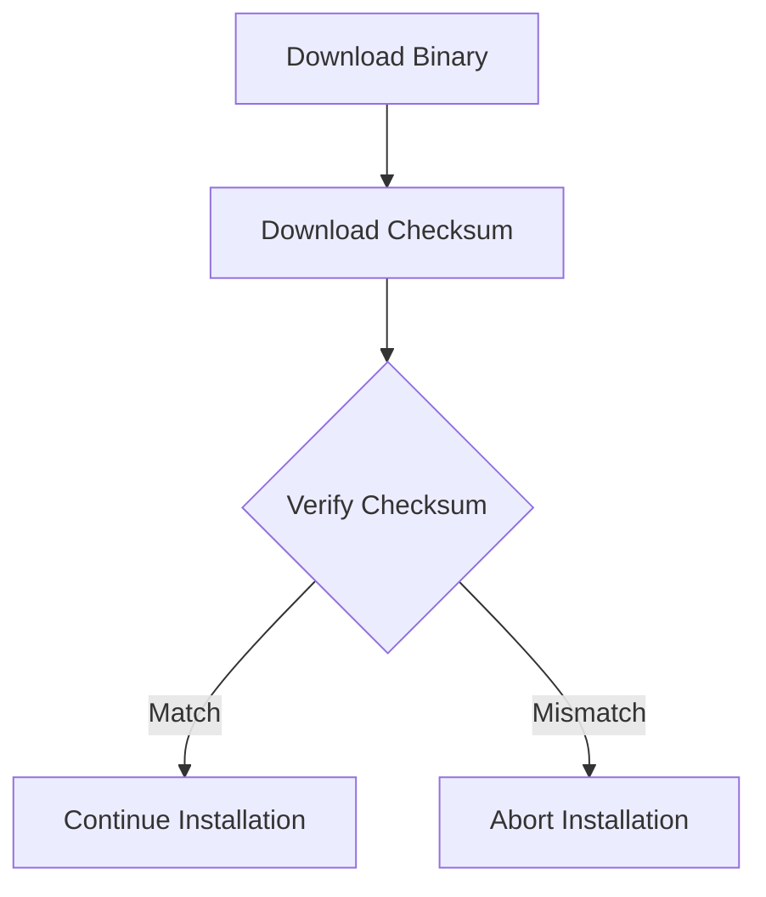
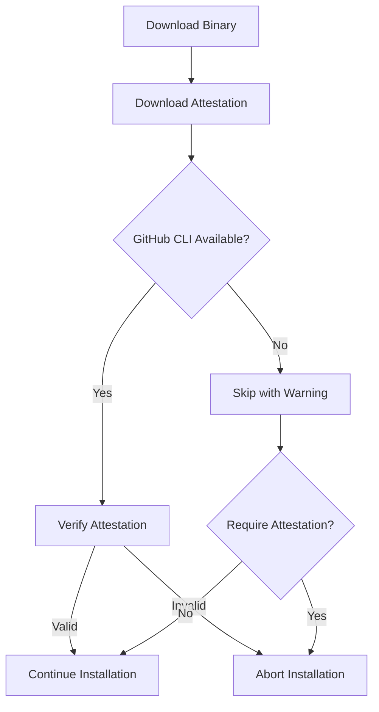

# GoDownloader Fork Security Considerations

This document outlines the security considerations for the GoDownloader fork, with a particular focus on the GitHub attestation verification feature and other security enhancements.

## Security Challenges in Binary Distribution

Distributing binaries securely over the internet presents several challenges:

1. **Integrity**: Ensuring the binary hasn't been tampered with during transit
2. **Authenticity**: Verifying the binary was created by the expected source
3. **Supply Chain Security**: Protecting against compromises in the build and distribution process
4. **Installation Safety**: Ensuring the installation process doesn't introduce vulnerabilities

The "curl | bash" pattern, while convenient, has been criticized for security concerns. This fork aims to address these concerns while maintaining the convenience of this installation method.

## Security Features

### 1. Checksum Verification



Checksum verification ensures the integrity of the downloaded binary by comparing its hash against a published checksum. This protects against:

- Corrupted downloads due to network issues
- Basic tampering attempts
- Incomplete downloads

However, checksums alone don't verify authenticity - if an attacker can replace both the binary and its checksum, this protection is bypassed.

### 2. GitHub Attestation Verification



GitHub Attestations provide cryptographically signed statements about artifacts, addressing the limitations of checksums by adding:

- **Authenticity**: Verification that the binary was built by the expected source
- **Provenance**: Information about how and when the binary was built
- **Tamper Evidence**: Cryptographic proof that the binary hasn't been modified

#### How Attestation Verification Works

The GitHub CLI's `attestation verify` command (version 2.69.0 or later) provides comprehensive verification capabilities:

1. **Signature Verification**: Validates the cryptographic signatures in the attestations
2. **Identity Validation**: Confirms the identity of the Actions workflow that produced the attestation
3. **Artifact Matching**: Verifies that the attestation refers to the provided artifact
4. **Policy Enforcement**: Applies additional policy checks as specified by the flags

The verification process includes:

1. The installation script downloads the binary and its attestation
2. It checks if the GitHub CLI is installed
3. If available, it uses the GitHub CLI to verify the attestation
4. If verification fails, the installation is aborted
5. If GitHub CLI is not available, it displays a warning and continues (unless attestation is required)

#### Passing Verification Flags

The implementation allows passing additional flags to the `gh attestation verify` command in two ways:

1. **At script generation time**: Using the `--gh-attestation-verify-flags` option with the `godownloader` command:

```bash
godownloader --repo=owner/repo --require-attestation \
  --gh-attestation-verify-flags="--deny-self-hosted-runners --cert-identity=https://github.com/owner/repo/.github/workflows/release.yml@refs/heads/main" \
  > install.sh
```

2. **At runtime**: Using the `GH_ATTESTATION_VERIFY_FLAGS` environment variable when running the installation script:

```bash
curl -sfL https://example.com/install.sh | GH_ATTESTATION_VERIFY_FLAGS="--deny-self-hosted-runners" sh
```

This approach provides flexibility for both script generators and end users.

#### Advanced Attestation Security Features

The GoDownloader fork leverages several advanced security features provided by the GitHub CLI:

##### Certificate Identity Verification

Ensures that the attestation was created by the expected workflow:

```bash
godownloader --repo=owner/repo --require-attestation \
  --gh-attestation-verify-flags="--cert-identity=https://github.com/owner/repo/.github/workflows/release.yml@refs/heads/main" \
  > install.sh
```

This prevents attacks where a compromised repository might generate valid but unauthorized attestations.

##### Self-hosted Runner Restrictions

Self-hosted runners may have weaker security guarantees than GitHub-hosted runners. The `--deny-self-hosted-runners` flag rejects attestations from self-hosted runners:

```bash
godownloader --repo=owner/repo --require-attestation \
  --gh-attestation-verify-flags="--deny-self-hosted-runners" \
  > install.sh
```

For convenience, there's also a shorthand option:

```bash
godownloader --repo=owner/repo --require-attestation --deny-self-hosted-runners > install.sh
```

##### Predicate Type Filtering

Allows verification of specific types of attestations:

```bash
godownloader --repo=owner/repo --require-attestation \
  --gh-attestation-verify-flags="--predicate-type=https://slsa.dev/provenance/v1" \
  > install.sh
```

##### Reusable Workflow Verification

For attestations generated by reusable workflows:

```bash
godownloader --repo=owner/repo --require-attestation \
  --gh-attestation-verify-flags="--signer-repo=actions/reusable-workflow" \
  > install.sh
```

### 3. HTTPS for Downloads

All downloads use HTTPS, which provides:

- Encryption of data in transit
- Server authentication to prevent man-in-the-middle attacks
- Protection against network-level tampering

### 4. Minimal Dependencies

The installation scripts have minimal dependencies, reducing the attack surface:

- Uses standard POSIX shell commands where possible
- Falls back to basic tools when specialized ones aren't available
- Avoids unnecessary external dependencies

## Security Improvements Over Original GoDownloader

| Security Feature | Original GoDownloader | This Fork |
|------------------|----------------------|-----------|
| Checksum Verification | ✅ | ✅ |
| HTTPS Downloads | ✅ | ✅ |
| GitHub Attestation Verification | ❌ | ✅ |
| Certificate Identity Verification | ❌ | ✅ |
| Self-hosted Runner Restrictions | ❌ | ✅ |
| Predicate Type Filtering | ❌ | ✅ |
| Minimal Dependencies | ✅ | ✅ |
| Configurable Security Options | ❌ | ✅ |

## GitHub Attestation Verification in Depth

### Attestation Format

GitHub attestations follow the [in-toto](https://in-toto.io/) format, which is a JSON structure containing:

```json
{
  "_type": "https://in-toto.io/Statement/v0.1",
  "predicateType": "https://slsa.dev/provenance/v1",
  "subject": [
    {
      "name": "example-binary-v1.0.0-linux-amd64.tar.gz",
      "digest": {
        "sha256": "e3b0c44298fc1c149afbf4c8996fb92427ae41e4649b934ca495991b7852b855"
      }
    }
  ],
  "predicate": {
    "buildType": "https://github.com/actions/runner/github-actions",
    "builder": {
      "id": "https://github.com/actions/runner"
    },
    "buildConfig": {
      "workflow": {
        "ref": "refs/tags/v1.0.0",
        "repository": "owner/repo",
        "path": ".github/workflows/release.yml"
      }
    },
    "metadata": {
      "buildInvocationID": "workflow_run_id",
      "completeness": {
        "parameters": true,
        "environment": true,
        "materials": false
      },
      "reproducible": false
    },
    "materials": [
      {
        "uri": "git+https://github.com/owner/repo",
        "digest": {
          "sha1": "commit_sha"
        }
      }
    ]
  },
  "signatures": [
    {
      "keyid": "keyid",
      "sig": "base64-encoded-signature"
    }
  ]
}
```

### Security Properties of Attestations

GitHub attestations provide several important security properties:

1. **Integrity**: The attestation includes a cryptographic hash of the binary, ensuring it hasn't been tampered with.
2. **Authenticity**: The attestation is signed by GitHub's OIDC token service, ensuring it was created by GitHub Actions.
3. **Non-repudiation**: The signature provides cryptographic proof that the attestation was created by GitHub Actions.
4. **Provenance**: The attestation includes information about the build process, including the repository, workflow, and commit.
5. **Traceability**: The attestation links the binary to the specific GitHub Actions workflow run that created it.

### GitHub CLI Attestation Verify Command

The `gh attestation verify` command provides comprehensive verification capabilities:

```
gh attestation verify [<file-path> | oci://<image-uri>] [--owner | --repo] [flags]
```

Key security-related flags include:

| Flag | Security Benefit |
|------|-----------------|
| `--cert-identity` | Ensures attestation was created by the expected workflow |
| `--cert-identity-regex` | Provides flexible matching for workflow identity |
| `--deny-self-hosted-runners` | Rejects attestations from potentially less secure environments |
| `--predicate-type` | Ensures attestation contains the expected type of information |
| `--signer-repo` | Validates attestations from reusable workflows |
| `--cert-oidc-issuer` | Verifies the issuer of the OIDC token |

### Security Levels

The GoDownloader fork supports different security levels for attestation verification:

1. **Basic Verification**: Verifies the attestation signature and binary digest
2. **Enhanced Verification**: Adds certificate identity verification
3. **Strict Verification**: Adds self-hosted runner restrictions and predicate type filtering

Users can choose the appropriate security level based on their requirements:

```bash
# Basic verification
godownloader --repo=owner/repo --require-attestation > install.sh

# Enhanced verification
godownloader --repo=owner/repo --require-attestation \
  --gh-attestation-verify-flags="--cert-identity=https://github.com/owner/repo/.github/workflows/release.yml@refs/heads/main" \
  > install.sh

# Strict verification
godownloader --repo=owner/repo --require-attestation \
  --gh-attestation-verify-flags="--cert-identity=https://github.com/owner/repo/.github/workflows/release.yml@refs/heads/main --deny-self-hosted-runners --predicate-type=https://slsa.dev/provenance/v1" \
  > install.sh
```

## Best Practices for Users

### For Project Maintainers

1. **Enable Attestations**: Configure your GitHub Actions workflow to generate attestations for your releases
2. **Use GitHub-hosted Runners**: Prefer GitHub-hosted runners over self-hosted runners for better security
3. **Document Workflow Identity**: Provide the exact workflow identity for users to verify
4. **Secure Build Process**: Use trusted build environments and minimize manual steps
5. **Regular Updates**: Keep your GoDownloader script updated to benefit from security improvements
6. **Documentation**: Inform your users about the security features and how to verify them

Example GitHub Actions workflow for generating attestations:

```yaml
name: Release with Attestations

on:
  push:
    tags:
      - 'v*'

jobs:
  goreleaser:
    runs-on: ubuntu-latest
    permissions:
      contents: write
      packages: write
      id-token: write  # Required for GitHub attestations
    steps:
      - name: Checkout
        uses: actions/checkout@v3
        with:
          fetch-depth: 0
          
      - name: Set up Go
        uses: actions/setup-go@v4
        
      - name: Run GoReleaser
        uses: goreleaser/goreleaser-action@v4
        with:
          distribution: goreleaser
          version: latest
          args: release --clean
        env:
          GITHUB_TOKEN: ${{ secrets.GITHUB_TOKEN }}
```

### For End Users

1. **Verify the Source**: Ensure you're downloading the script from the official repository
2. **Check for HTTPS**: Always use HTTPS URLs for downloading scripts
3. **Install GitHub CLI**: Install the GitHub CLI (version 2.69.0 or later) for attestation verification
4. **Use Attestation Verification**: Don't disable attestation verification unless necessary
5. **Report Issues**: If you encounter security issues, report them to the project maintainers

## Security Limitations and Mitigations

### Limitations

1. **Trust in GitHub**: The security model relies on trust in GitHub's infrastructure
2. **Requires Network Access**: Verification requires access to GitHub's servers
3. **Script Execution**: The initial script is still executed without verification
4. **GitHub CLI Dependency**: Attestation verification requires the GitHub CLI

### Mitigations

1. **Optional Verification**: Attestation verification is optional by default
2. **Clear Warnings**: Clear warnings when GitHub CLI is not available
3. **Script Transparency**: Clear, readable scripts that can be inspected before execution
4. **Documentation**: Clear documentation of security features and limitations

## Future Security Enhancements

1. **Multiple Attestation Types**: Support for different types of attestations (build, security scan, etc.)
2. **Custom Verification Policies**: Allow projects to specify custom verification requirements
3. **Reproducible Builds**: Support for verifying that binaries match source code
4. **Vulnerability Scanning**: Integration with vulnerability databases to check for known issues
5. **SLSA Compliance**: Support for [Supply-chain Levels for Software Artifacts (SLSA)](https://slsa.dev/) framework
6. **Alternative Verification Tools**: Support for using tools like `cosign` for verification when GitHub CLI is not available

## Reporting Security Issues

If you discover a security vulnerability in the GoDownloader fork, please report it responsibly by:

1. **Not** disclosing the issue publicly until it has been addressed
2. Submitting the details to the project maintainers directly
3. Providing sufficient information to reproduce and understand the issue

## Conclusion

The GoDownloader fork significantly enhances the security of the binary installation process through GitHub attestation verification and other security improvements. By leveraging the comprehensive verification capabilities of the GitHub CLI, it provides strong protection against supply chain attacks and other security threats while maintaining the convenience of the "curl | bash" installation pattern.